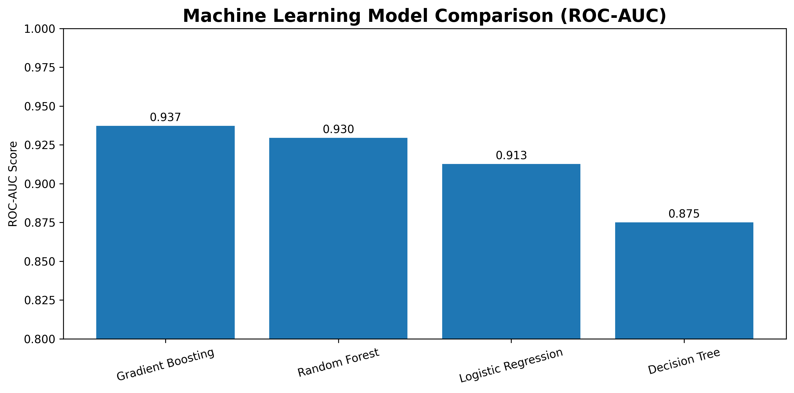
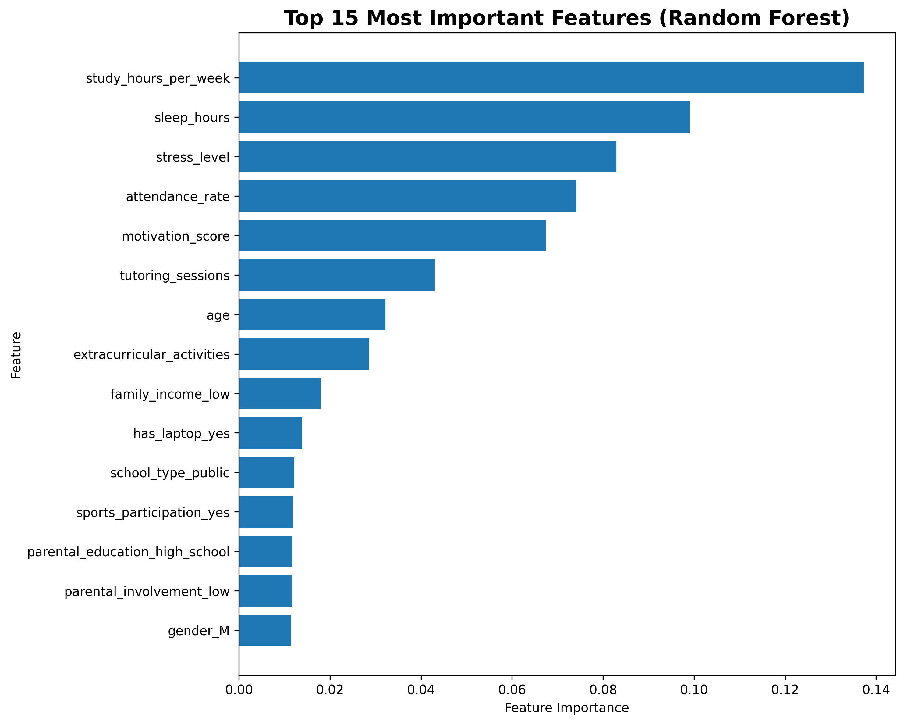
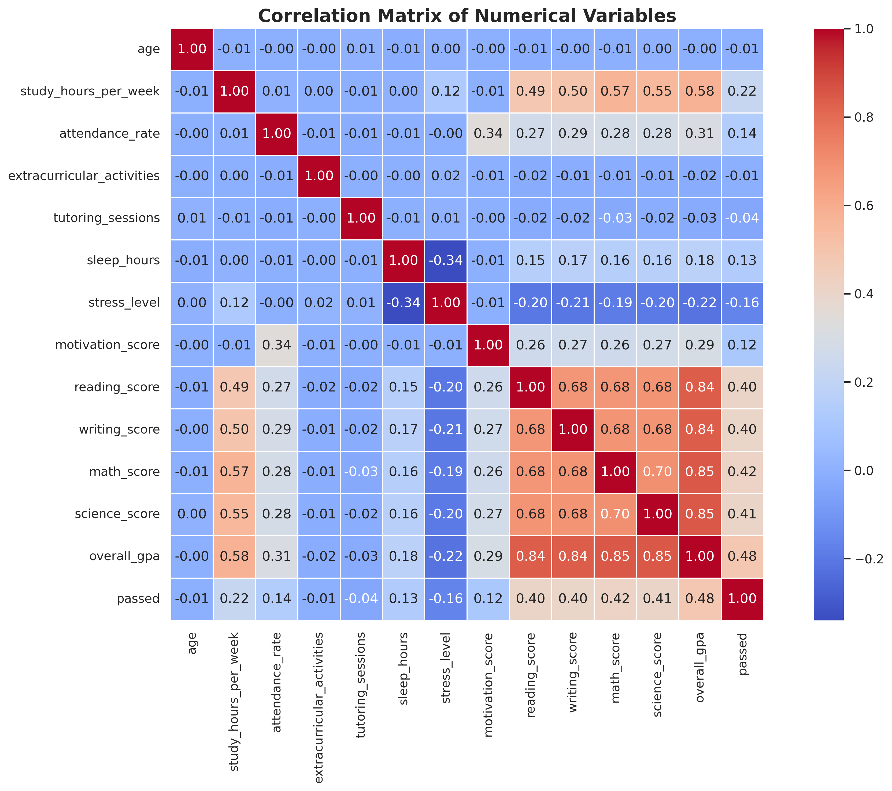
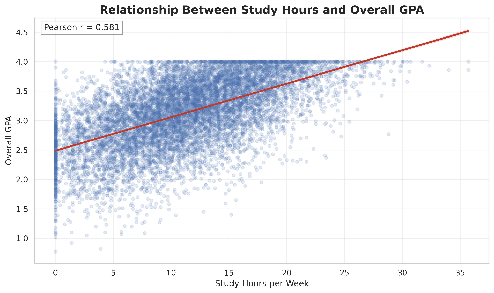
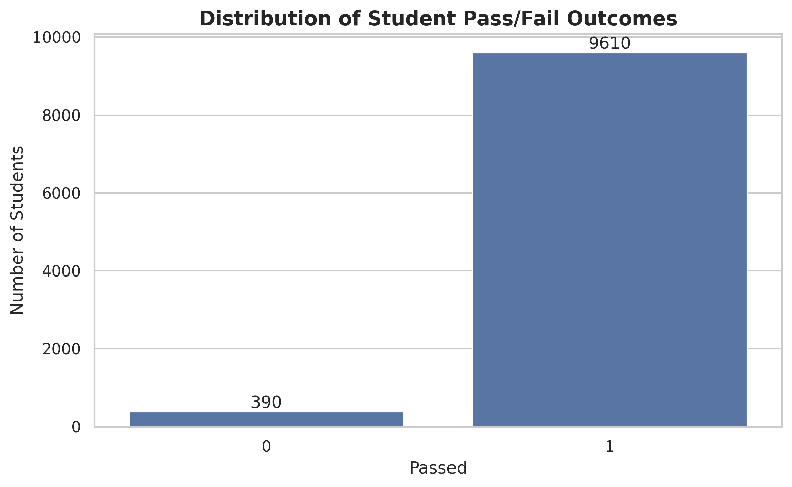

# 🎓 Student Performance Classification Using Machine Learning


> **Portfolio Project | Machine Learning | Predictive Analytics | Classification | Python | Scikit-Learn**

An end-to-end machine learning project demonstrating how predictive analytics can identify students at academic risk using demographic, behavioral, and academic data. This project showcases the complete data science lifecycle—from data preparation and exploratory analysis to model development, evaluation, and business recommendations.

---

# 📖 Project Overview

Educational institutions face ongoing challenges in identifying students who may be at academic risk before poor performance leads to course failure or withdrawal. Predictive analytics enables educators to proactively identify these students and provide targeted interventions that improve student success and retention.

This project develops and compares multiple supervised machine learning models to classify whether a student is likely to pass or fail based on academic performance, study habits, attendance, lifestyle, and demographic characteristics.

Beyond predictive performance, this project emphasizes model interpretability, ethical AI practices, and practical business recommendations for educational decision-makers.

---

# 🎯 Business Objective

The objective of this project is to develop a predictive classification model capable of identifying students who may benefit from early academic intervention while maintaining transparency, fairness, and responsible use of educational data.

Potential applications include:

- Early intervention programs
- Academic advising
- Student retention initiatives
- Student success analytics
- Resource allocation
- Institutional decision support

---

# ⭐ Project Highlights

- Complete end-to-end machine learning workflow
- Four supervised classification models
- Exploratory Data Analysis (EDA)
- Feature engineering and preprocessing pipeline
- Business-focused model evaluation
- Feature importance analysis
- Ethical AI and responsible analytics considerations
- Professional documentation with reproducible notebooks

---

# 📂 Repository Structure

```text
student-exam-performance-classification/

├── data/
│   ├── raw/
│   ├── processed/
│   └── model/
│
├── images/
│
├── models/
│
├── notebooks/
│
├── reports/
│
├── README.md
├── LICENSE
└── .gitignore
```

---

# 🔄 Project Workflow

1. Data Understanding
2. Data Cleaning & Preparation
3. Exploratory Data Analysis
4. Feature Engineering
5. Machine Learning Model Development
6. Model Evaluation
7. Business Recommendations
8. Executive Summary

---

# 🛠 Technologies

- Python
- Pandas
- NumPy
- Matplotlib
- Seaborn
- Scikit-learn
- Google Colab
- Jupyter Notebook

---

# 🤖 Machine Learning Models

Four supervised learning algorithms were trained and compared to evaluate tradeoffs between predictive performance, interpretability, and practical implementation.

The following models were developed:

- Logistic Regression
- Decision Tree
- Random Forest
- Gradient Boosting

Each model was evaluated using:

- Accuracy
- Precision
- Recall
- F1 Score
- ROC-AUC
- Confusion Matrix
- Feature Importance

---

# 🏆 Model Performance

| Model | Accuracy | Precision | Recall | F1 Score | ROC-AUC |
|-------|---------:|----------:|--------:|---------:|--------:|
| **Gradient Boosting** | **0.9650** | **0.9667** | **0.9979** | **0.9821** | **0.9373** |
| Random Forest | 0.9610 | 0.9610 | 1.0000 | 0.9801 | 0.9296 |
| Logistic Regression | 0.9610 | 0.9610 | 1.0000 | 0.9801 | 0.9127 |
| Decision Tree | 0.8765 | 0.9878 | 0.8824 | 0.9321 | 0.8750 |

---

# 📊 Visualizations

## Machine Learning Model Comparison



---

## Random Forest Feature Importance



---

## Correlation Heatmap



---

## Relationship Between Study Hours and GPA



---

## Student Pass vs Fail Distribution



---

# 🔍 Key Findings

- Gradient Boosting achieved the highest overall ROC-AUC score (0.9373), making it the strongest-performing model evaluated.
- Study hours per week were the single most important predictor of academic success.
- Sleep duration, stress level, attendance rate, and motivation score consistently ranked among the strongest predictive variables.
- Behavioral and academic characteristics contributed more to prediction accuracy than demographic variables.
- Feature importance analysis provides actionable insights that educational institutions can use to support early intervention and improve student outcomes.

---

# ⚖️ Ethics & Responsible AI

This project emphasizes the responsible use of predictive analytics within educational environments by addressing:

- Student privacy and confidentiality
- Ethical use of educational data
- Transparency and model interpretability
- Human oversight in academic decision-making
- Algorithmic bias awareness
- Responsible AI practices
- Data governance principles

Predictive analytics should support educators and advisors—not replace human judgment or become the sole basis for academic decisions.

---

# 🚀 Future Improvements

Future enhancements for this project include:

- Hyperparameter optimization using GridSearchCV
- K-Fold Cross Validation
- XGBoost and LightGBM models
- SHAP explainability
- Fairness and bias evaluation metrics
- Interactive Streamlit dashboard
- Automated model retraining pipeline
- REST API for real-time predictions

---

# 📝 Notes

Due to GitHub file size limitations, the serialized Random Forest model and intermediate training/testing datasets are not included in this repository. All models can be reproduced by running **Notebook 05 – Machine Learning Model Development**.

---

# 👩‍💻 Author

## **Tessa Becker**

**Founder | Kronos Intelligence**

Data Analytics • Predictive Analytics • Machine Learning • Data Governance • Business Intelligence

Kronos Intelligence develops practical data-driven solutions that transform complex information into actionable insights through analytics, visualization, and machine learning.

---

## ⭐ If you found this project helpful or interesting, please consider starring the repository!

Data Analytics | Data Governance | Machine Learning

Building data-driven solutions through **Kronos Intelligence**.
